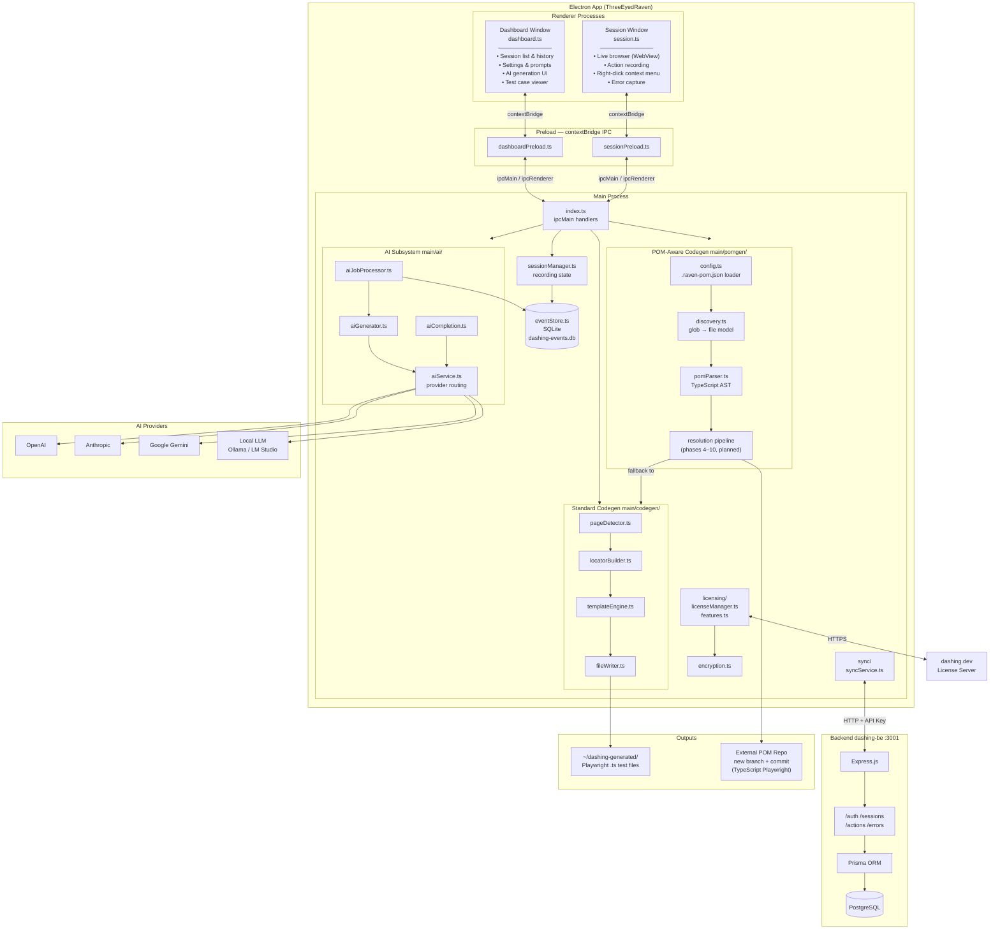

# ThreeEyedRaven — Architecture



## Component summary

| Layer | Technology | Responsibility |
|---|---|---|
| **Renderer — Dashboard** | TypeScript + HTML/CSS | Session management, settings, AI job UI, test history |
| **Renderer — Session** | TypeScript + Electron WebView | Live browser recording, DOM action capture, context menus |
| **Preload** | Electron contextBridge | Secure IPC bridge (no `remote`, no `nodeIntegration`) |
| **Main Process** | TypeScript / Node | Orchestrates all subsystems via `ipcMain` |
| **eventStore** | SQLite (`better-sqlite3`) | Persists recorded actions, errors, sessions, AI jobs |
| **AI subsystem** | `aiService` + provider adapters | Routes generation jobs to OpenAI / Anthropic / Gemini / local LLM |
| **Standard Codegen** | AST + templates | Derives pages + locators from recordings → Playwright `.ts` files |
| **POM-Aware Codegen** | TypeScript Compiler API | Resolves recorded actions against an existing external POM repo; emits method calls or appends new methods on a local branch |
| **Licensing** | Custom + dashing.dev | Feature gating; encryption of license keys |
| **Sync** | HTTP client | Uploads sessions/actions/errors to the backend for cloud history |
| **Backend (dashing-be)** | Express + Prisma + PostgreSQL | Cloud sync API; license activation; multi-user session storage |
| **AI Providers** | OpenAI / Anthropic / Gemini / Local | LLM completions for test-case generation |
```
